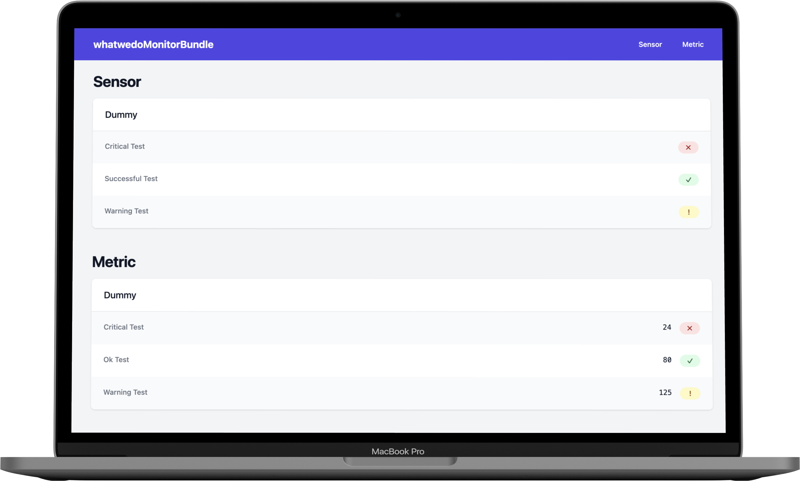

# Checking states

## Dashboard



The Dashboard shows all sensors and metrics on a website.

If you want to protect the endpoint, you can use the [Symfony Security access control](https://symfony.com/doc/current/security.html#securing-url-patterns-access-control).

You can disable the controller in the configuration (don't forget to remove the routing configuration):

```yaml
whatwedo_monitor:
    endpoint:
        controller:
            enabled: false
```

To overwrite the design of the dashboard, check the [Symfony docs for overwriting parts of a Bundle](https://symfony.com/doc/current/bundles/override.html#templates).

## Command line


The command line interface provides a simple way to check the state.

```bash
bin/console whatwedo:monitor:check
```

You can disable the command line interface in the configuration:

```yaml
whatwedo_monitor:
    endpoint:
        command:
            enabled: false
```

## HTTP API


The HTTP API provides a way to integrate the health check into your monitoring infrastructure. 

- Returns an HTTP 200 status code if the state is healthy
- Returns an HTTP 503 status code if the state is unhealthy

You can either protect the endpoint with the [Symfony Security component](https://symfony.com/doc/current/security.html), or you can add a token to your configuration:

```yaml
parameters:
    env(MONITOR_API_TOKEN): 'secret'

whatwedo_monitor:
    endpoint:
        api:
            auth_token: '%env(resolve:MONITOR_API_TOKEN)%'
```

Then you can curl the endpoint:

```bash
curl -H "X-Auth-Token: secret" https://example.com/api/check.json
curl -H "X-Auth-Token: secret" https://example.com/api/check.json?pretty
curl -H "X-Auth-Token: secret" https://example.com/api/check.xml
```

You can disable the HTTP API in the configuration (don't forget to remove the routing configuration):

```yaml
whatwedo_monitor:
    endpoint:
        api:
            enabled: false
```

